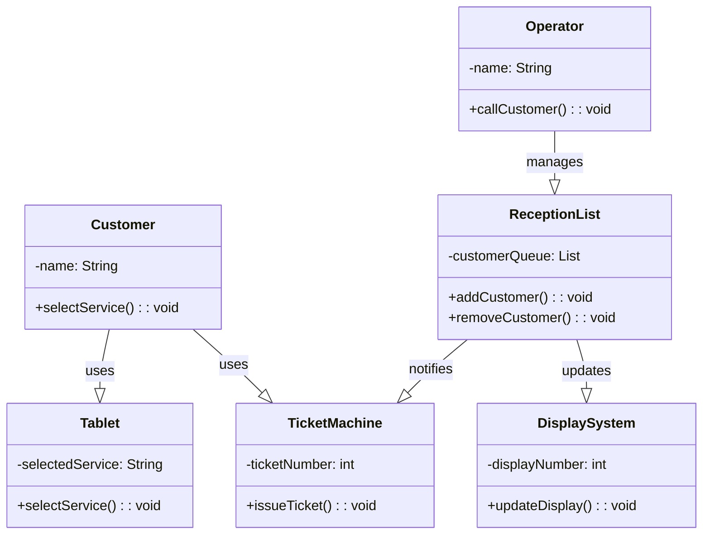
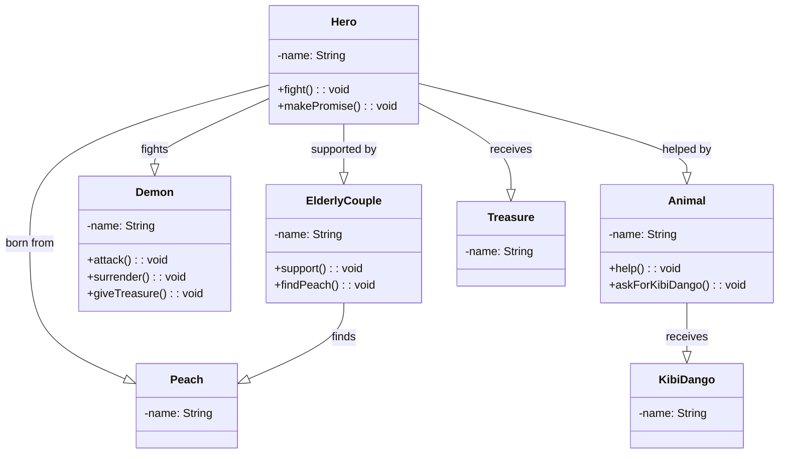
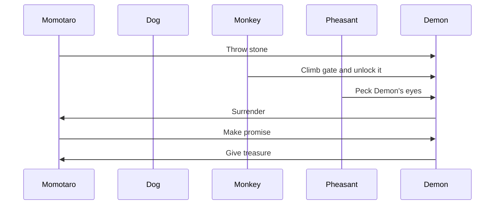
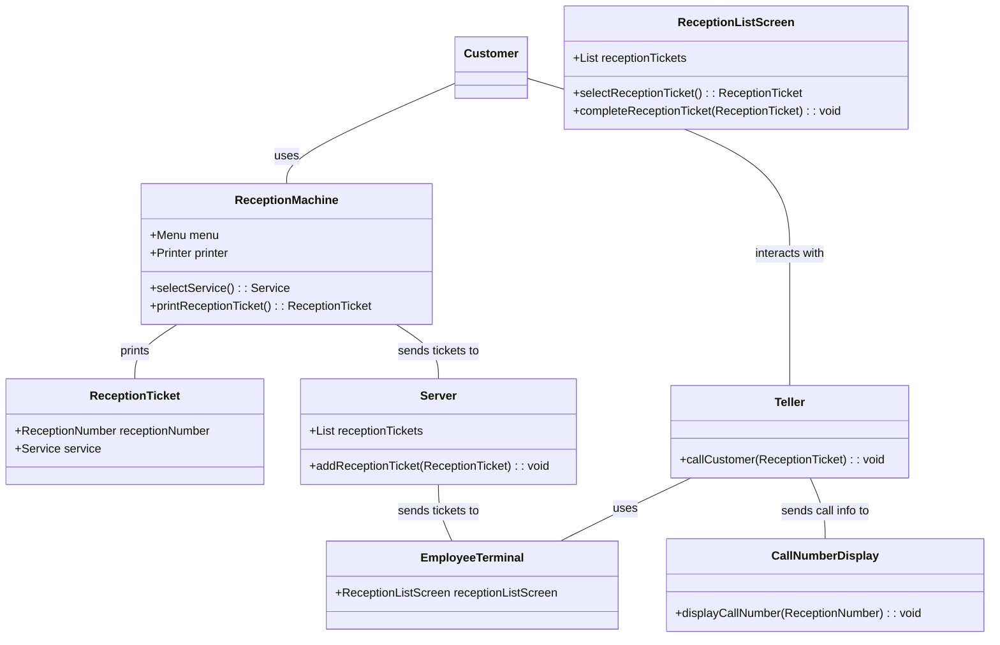

# domai

# 銀行の受付をドメインにしてみた

```mermaid
classDiagram
    class Customer {
        -name: String
        +selectService(): void
    }
    class Operator {
        -name: String
        +callCustomer(): void
    }
    class TicketMachine {
        -ticketNumber: int
        +issueTicket(): void
    }
    class ReceptionList {
        -customerQueue: List<Customer>
        +addCustomer(): void
        +removeCustomer(): void
    }
    class DisplaySystem {
        -displayNumber: int
        +updateDisplay(): void
    }
    class Tablet {
        -selectedService: String
        +selectService(): void
    }
    
    Customer --|> Tablet : uses
    Customer --|> TicketMachine : uses
    Operator --|> ReceptionList : manages
    ReceptionList --|> TicketMachine : notifies
    ReceptionList --|> DisplaySystem : updates
```
---

# 桃太郎をドメインモデルにしてみた

```mermaid 
classDiagram
    class Hero {
        -name: String
        +fight(): void
        +makePromise(): void
    }
    class ElderlyCouple {
        -name: String
        +support(): void
        +findPeach(): void
    }
    class Demon {
        -name: String
        +attack(): void
        +surrender(): void
        +giveTreasure(): void
    }
    class Animal {
        -name: String
        +help(): void
        +askForKibiDango(): void
    }
    class Treasure {
        -name: String
    }
    class KibiDango {
        -name: String
    }
    class Peach {
        -name: String
    }
    
    Hero --|> ElderlyCouple : supported by
    Hero --|> Animal : helped by
    Hero --|> Demon : fights
    Hero --|> Treasure : receives
    Hero --|> Peach : born from
    Animal --|> KibiDango : receives
    ElderlyCouple --|> Peach : finds
```

## 桃太郎バトルシーケンス

```mermaid
sequenceDiagram
    participant Momotaro as Momotaro
    participant Dog as Dog
    participant Monkey as Monkey
    participant Pheasant as Pheasant
    participant Demon as Demon
    Momotaro->>Demon: Throw stone
    Monkey->>Demon: Climb gate and unlock it
    Pheasant->>Demon: Peck Demon's eyes
    Demon->>Momotaro: Surrender
    Momotaro->>Demon: Make promise
    Demon->>Momotaro: Give treasure


```

## 受付のドメインモデル

```mermaid
classDiagram
    class Customer {
    }
    class ReceptionMachine {
        +Menu menu
        +Printer printer
        +selectService(): Service
        +printReceptionTicket(): ReceptionTicket
    }
    class ReceptionTicket {
        +ReceptionNumber receptionNumber
        +Service service
    }
    class Server {
        +List<ReceptionTicket> receptionTickets
        +addReceptionTicket(ReceptionTicket): void
    }
    class EmployeeTerminal {
        +ReceptionListScreen receptionListScreen
    }
    class ReceptionListScreen {
        +List<ReceptionTicket> receptionTickets
        +selectReceptionTicket(): ReceptionTicket
        +completeReceptionTicket(ReceptionTicket): void
    }
    class Teller {
        +callCustomer(ReceptionTicket): void
    }
    class CallNumberDisplay {
        +displayCallNumber(ReceptionNumber): void
    }
    Customer -- ReceptionMachine : uses
    ReceptionMachine -- ReceptionTicket : prints
    ReceptionMachine -- Server : sends tickets to
    Server -- EmployeeTerminal : sends tickets to
    Teller -- EmployeeTerminal : uses
    Teller -- CallNumberDisplay : sends call info to
    Customer -- Teller : interacts with
```
